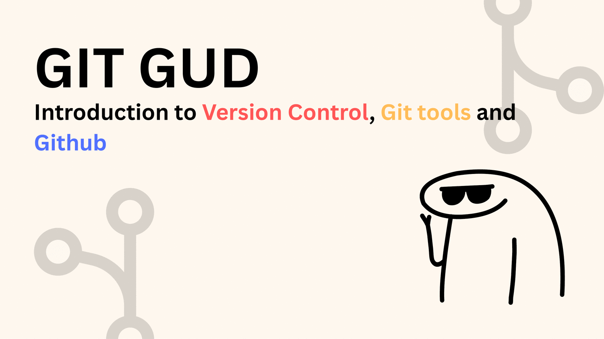
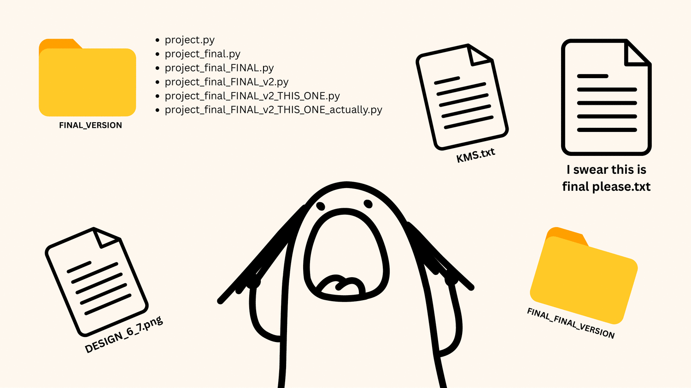
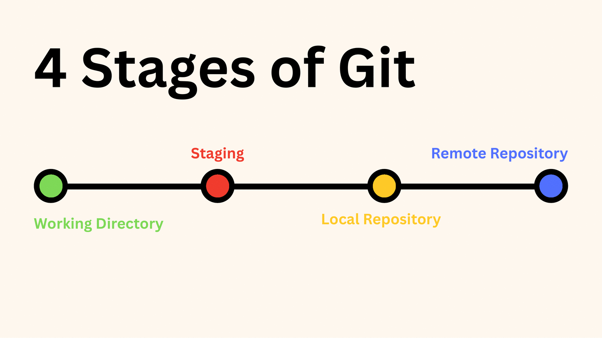
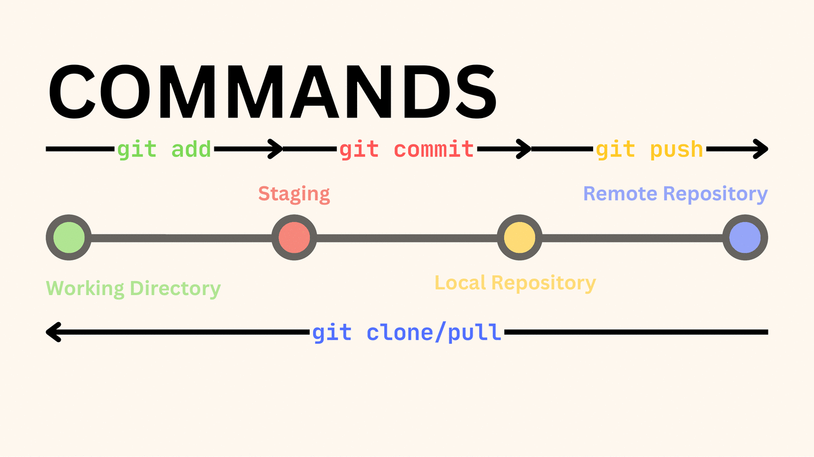
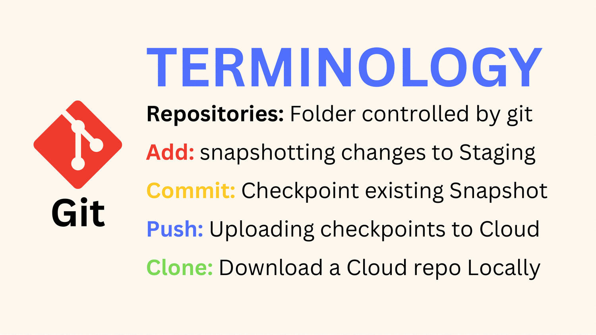
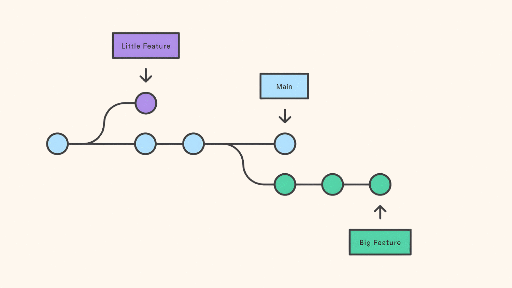
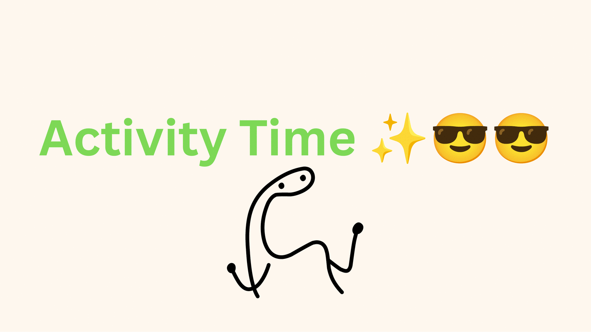

<div align="center">



# 🏴‍☠️ GIT GUD — The Bounty Wall

**SUTD · GIT GUD 2026 — Intro to Version Control, Git & GitHub**

Make your own One Piece-style **bounty poster**, ship it with a real **pull request**, and watch it appear on a live gallery built automatically by **GitHub Actions** + **GitHub Pages**.

[](https://angks.github.io/SUTD-Git-Gud-2026-Workshop/)
&nbsp;
[](https://www.sutd.edu.sg/)

### 👉 [**See everyone's posters live →**](https://angks.github.io/SUTD-Git-Gud-2026-Workshop/)

</div>

---

## 🎯 What is this?

This is the **hands-on activity** for the GIT GUD workshop. By the end you will have used the real Git workflow that software teams use every day:

> **clone → branch → edit → commit → push → pull request → merge → deploy**

Every poster that gets merged into `main` is automatically compiled into one big, mobile-friendly collage and published to GitHub Pages. No copying files over WhatsApp. No `project_final_FINAL_v2_THIS_ONE_actually.html`. Just Git. 😎

<div align="center">

</div>

---

## 🧠 A 30-second Git refresher

Git moves your changes through **four stages**. You only ever need a handful of commands to push work all the way from your laptop to the cloud.

<div align="center">

<br/><br/>

<br/><br/>

</div>

| Term | Meaning |
| --- | --- |
| **Repository** | A folder that Git is tracking (this repo!). |
| **`git add`** | Snapshot your changes into the **staging** area. |
| **`git commit`** | Save a checkpoint of the staged snapshot. |
| **`git push`** | Upload your commits to the cloud (GitHub). |
| **`git clone` / `pull`** | Download a repo / grab the latest changes. |
| **Branch** | A safe parallel timeline to work on without touching `main`. |
| **Pull Request (PR)** | A request to merge your branch into `main`, reviewed first. |

<div align="center">

<p><em>You work on your own <strong>branch</strong>, then open a <strong>pull request</strong> to merge it into <code>main</code>.</em></p>
</div>

---

## ✨ The Activity — make your bounty poster

<div align="center">

</div>

> You'll need **Git** installed and a **GitHub account**. Replace `<your-username>` with your GitHub username everywhere below.

### 1. Clone the repo
```bash
git clone https://github.com/AngKS/SUTD-Git-Gud-2026-Workshop.git
cd SUTD-Git-Gud-2026-Workshop
```

### 2. Make your own branch
```bash
git checkout -b branch/<your-username>
```

### 3. Copy the template into your own folder
This keeps everyone's work separate, so nobody's changes ever collide. 🙌

```bash
# macOS / Linux
cp -r template participants/<your-username>

# Windows (PowerShell)
Copy-Item -Recurse template participants\<your-username>
```

### 4. Edit your poster to your liking
Open `participants/<your-username>/index.html` and `style.css` and go wild:
- Change the big word (`WANTED` → `GOATED`, `LEGEND`, …), your **name**, tagline and **bounty**.
- Replace `profile.png` with your own photo (keep the filename, or update the `src`).
- Tweak colours, fonts and sizes in `style.css`. You can't break anything permanently — that's the whole point of version control. 😉

> 💡 **Preview locally:** open `participants/<your-username>/index.html` in your browser, or run `python3 -m http.server` from the repo root and visit the printed URL.

### 5. Commit & push your branch
```bash
git add participants/<your-username>
git commit -m "Add <your-username>'s bounty poster"
git push -u origin branch/<your-username>
```

### 6. Open a Pull Request
Go to the repo on GitHub → **Compare & pull request** → base = `main`, compare = `branch/<your-username>` → **Create pull request**.

### 7. 🎉 Get merged → see yourself on the wall
Once your PR is merged, a GitHub Actions workflow rebuilds the gallery and your poster goes live (give it a minute or two):

### 👉 https://angks.github.io/SUTD-Git-Gud-2026-Workshop/

---

## 🗂️ Repo structure

```
SUTD-Git-Gud-2026-Workshop/
├── template/                  # 👈 copy this to start (don't edit in place)
│   ├── index.html
│   ├── style.css
│   ├── paper.jpg
│   ├── profile.png
│   └── sutd-logo.png
├── participants/              # everyone's posters live here
│   ├── example/               # a finished example (look, don't touch)
│   └── <your-username>/       # 👈 your folder
├── scripts/
│   └── build-collage.mjs      # builds the gallery from participants/
├── .github/workflows/
│   └── deploy.yml             # runs the build + deploys to Pages on every merge
├── assets/                    # workshop slides (PDF) + images used in this README
└── README.md
```

---

## ⚙️ How the magic works

```
PR merged to main
      │
      ▼
GitHub Actions (.github/workflows/deploy.yml)
      │   runs: node scripts/build-collage.mjs
      ▼
dist/  ← collage index.html + every participant folder
      │
      ▼
GitHub Pages  →  https://angks.github.io/SUTD-Git-Gud-2026-Workshop/
```

Each poster is embedded as an isolated `<iframe>`, so no matter how creative someone's CSS gets, it can never break anyone else's card or the overall layout. The gallery is fully **mobile-responsive** and gives every participant their own accent colour.

---

## 🧑‍🏫 For the host (one-time setup)

1. **Settings → Pages → Build and deployment → Source:** select **GitHub Actions**.
2. Push this repo to `main`. The first run of the workflow publishes the site.
3. *(Optional)* **Settings → Branches:** protect `main` and require a PR before merging, so the activity mirrors a real team workflow.
4. *(Optional)* **Settings → Actions → General:** allow PRs from contributors to be merged by maintainers.

---

## 📑 Workshop slides

The full slide deck is included here: **[`assets/GIT-GUD-slides.pdf`](assets/GIT-GUD-slides.pdf)**.

---

<div align="center">

Built with branches & pull requests at **SUTD** · GIT GUD 2026 🐙

</div>
